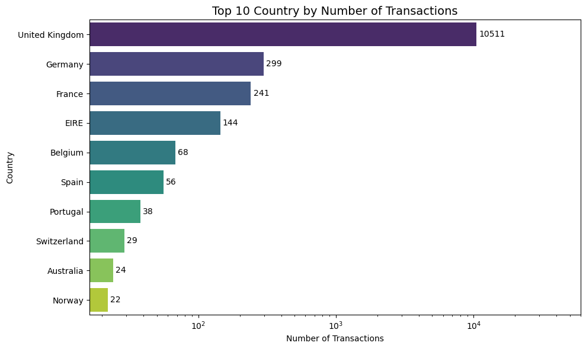
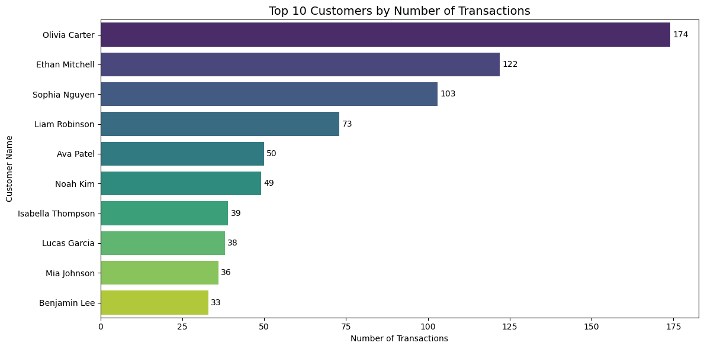
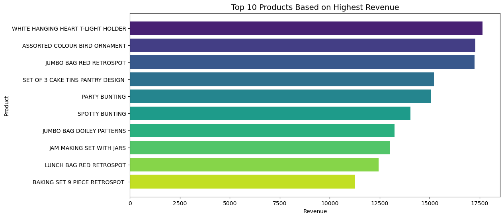
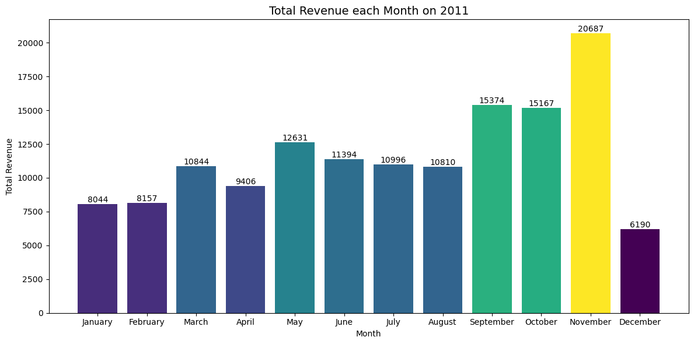

# Online Retail Analysis
## Project Background

## Tools Used
**Python**:
1. Pandas: a powerful Python library used for data analysis and manipulation, such as cleaning datasets, aggregating data, and performing statistical calculations.
2. Matplotlib: a Python library for creating visualizations, including line plots, bar charts, histograms, and more, to help interpret data.
3. Data Wrangler (VS Code Extension): a VS Code extension that provides pre-built code snippets and interactive tools to speed up data analysis workflows in Python, especially when working with Pandas and Matplotlib.
## Dataset Source
**UCL Machine Learning Repository**: [Online Retail Dataset](https://archive.ics.uci.edu/dataset/352/online+retail)

This is a transactional data set which contains all the transactions occurring between 01/12/2010 and 09/12/2011 for a UK-based and registered non-store online retail.The company mainly sells unique all-occasion gifts. Many customers of the company are wholesalers.

## What I've Learned So Far
1.  Common data exploration: count missing values, drop the missing values that comes from `CustomerID` because they are invalid data, clean duplicates from Invoice Number so that each Invoice Number is unique (this still need to be verified by the author), get the data statistics summary.
2.  Visualize some plots related to Business Performance & Revenue Analysis

## Visualization using Matplotlib

